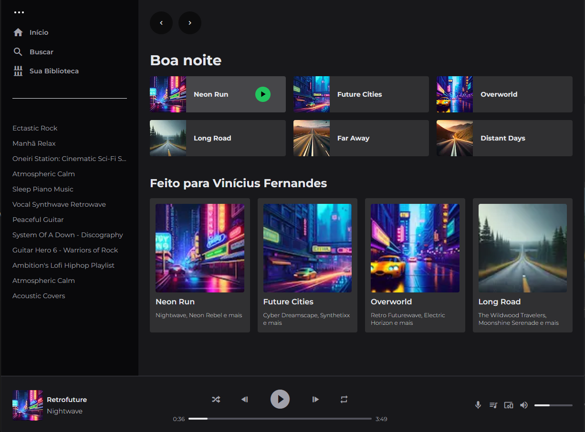
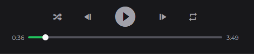
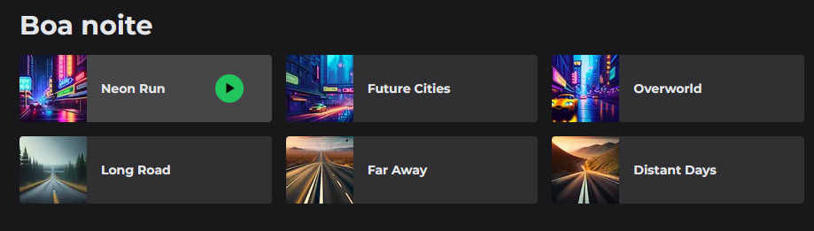

# Spoti-Wind

Recriação básica do frontend do Spotify utilizando TailwindCSS em NextJS.

## Como testar?

```bash
$ git clone https://github.com/volinha/spoti-wind
$ cd spoti-wind
$ npm install
$ npm run dev
```

Para alterar os nomes, basta alterar o arquivo `src/app/assets/data.json` para o desejado.

## Screenshots

<p align="center" style="display: flex; align-items: flex-start; justify-content: center;">
  
</p>

<p align="center" style="display: flex; align-items: flex-start; justify-content: center;">
  
</p>

<p align="center" style="display: flex; align-items: flex-start; justify-content: center;">
  
</p>

## Tecnologias

- [NextJS](nextjs.org)
- [TailwindCSS](https://tailwindcss.com)
- [Visual Studio Code](https://code.visualstudio.com)
- [Midjourney](https://www.midjourney.com)

## Atualizações Futuras

- [ ] Responsividade
- [ ] Degradê da área principal
- [ ] Estados de hover em todos elementos
- [ ] Componentização dos elementos
- [ ] Criação de mais páginas

## Disclaimer

*Este projeto é uma recriação da interface do aplicativo Spotify e não tem afiliação, patrocínio ou endosso do Spotify ou de qualquer uma de suas afiliadas. Todos os direitos autorais, marcas registradas e outros direitos de propriedade intelectual relacionados ao aplicativo Spotify pertencem exclusivamente ao Spotify. Este projeto é apenas para fins educacionais e não deve ser utilizado para fins comerciais ou de lucro pessoal.*

#

#### 💻 Desenvolvido com 💖 por Vinícius Fernandes
[](https://www.facebook.com/viniciusfvb)
[](https://www.linkedin.com/in/viniciusfernandesdev/)
[](https://twitter.com/volafernandes)
<a href = "mailto:viniciusfernandesdev@gmail.com"></a>
<br />